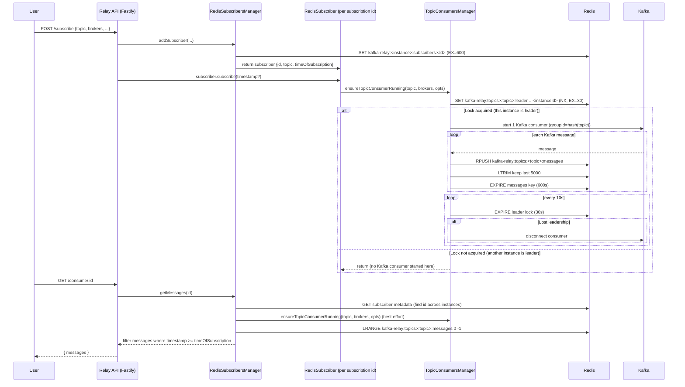
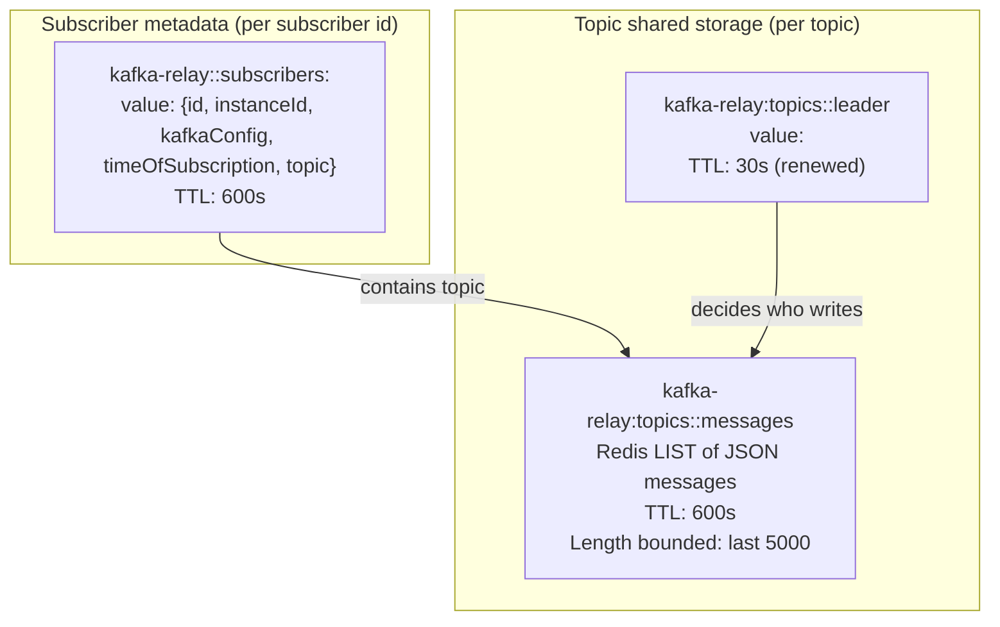

``````mermaid
flowchart LR
  subgraph Redis
    LOCK["topic leader lock"]
    LIST["topic messages list"]
  end

  subgraph InstanceA["Relay instance A"]
    A["Topic consumer (only if leader)"]
  end

  subgraph InstanceB["Relay instance B"]
    B["Topic consumer (only if leader)"]
  end

  A --> LOCK
  B --> LOCK

  A -->|"if leader"| LIST
  B -->|"if leader"| LIST
```